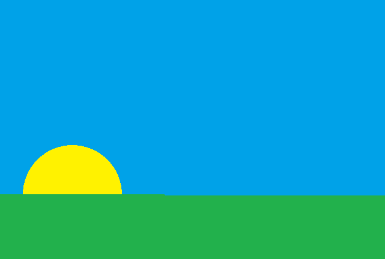
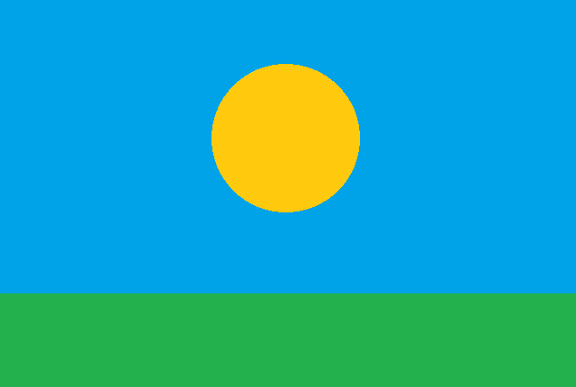

<h2 align="center">Opis zadania Sun Animation</h2>

 

## Wymagana wiedza

-   Podstawowa znajomość HTML i CSS.

## Cele główne

-   [ ] Stwórz animację, w której słońce w sposób płynny będzie poruszać się po obwodzie zgodnie z zamieszczonymi zdjęciami.
-   [ ] Animacja ma trwać 10s.

 

 

## Cele opcjonalne do wykonania

-   [ ] Dołóż do animacji księżyc, który w podobny sposób będzie się przemieszcał.
-   [ ] Pamiętaj o zmianach koloru nieba.

## Przydatne linki

-   Importowanie styli do HTML - https://www.w3schools.com/html/html_css.asp
-   Intro do HTML CSS - https://www.youtube.com/watch?v=mU6anWqZJcc
